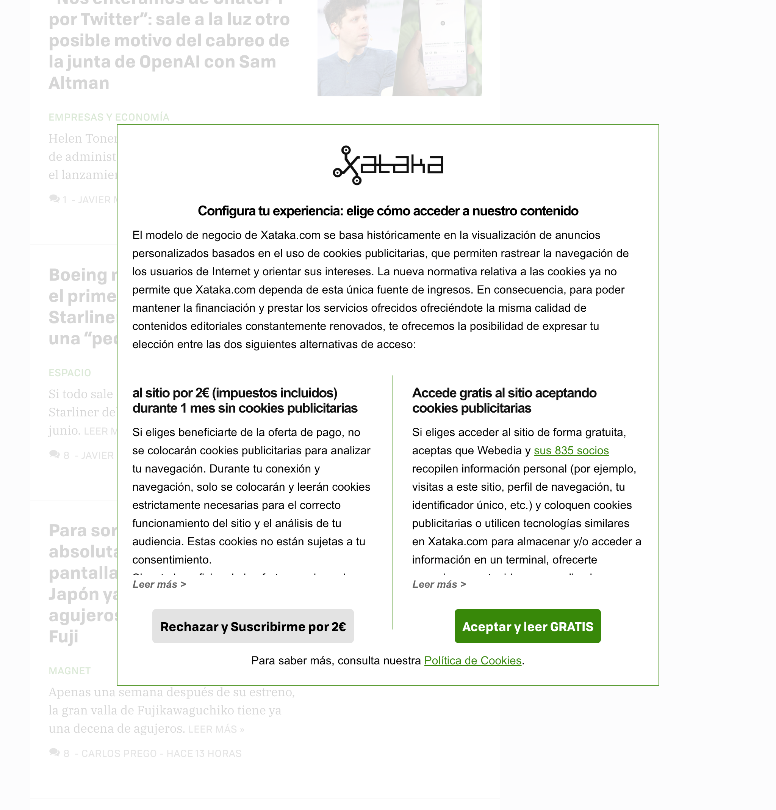
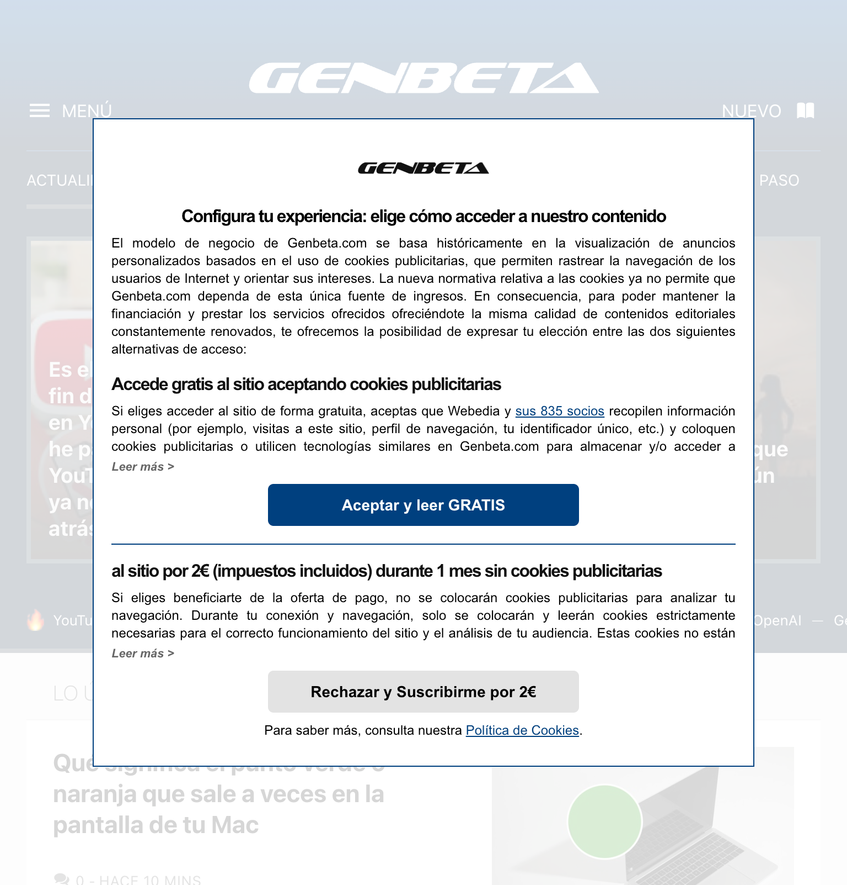
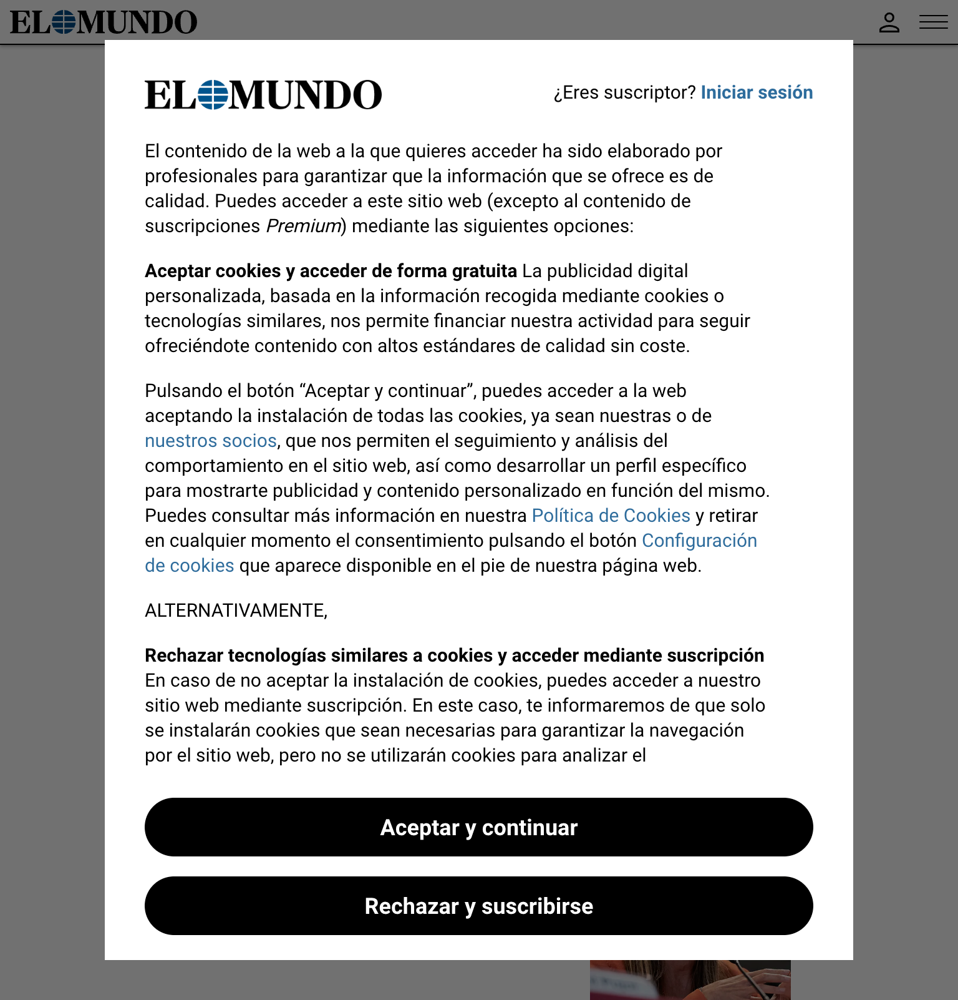
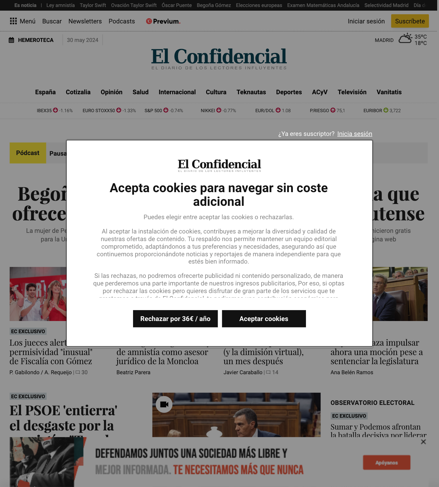

# I don want to pay to reject cookies (Didomi Consent modal remover)

For all of us, our Internet experience has been marked by the invasion of cookies, these small files that record our activities and preferences on the web. I understand the need for these things to offer personalized services, and I oppose the growing practice of paying users to reject them.

The right to privacy is fundamental and should not be a reserved privilege for those who can afford it. Paying to reject cookies creates an unfair digital divide and favors the monetization of our personal data. This is an abuse that we cannot allow.


|                |                          |         
|----------------|-------------------------------|

|                |                          |         
|----------------|-------------------------------|
    

# Compatibility

Works in all browsers I guess

# Usage

To use this extension locally in your machine.

Clone the repo Using terminal

```
git clone git@github.com:sys-walker/diomi-consent-modal-remover.git

```

### For Firefox Users:
go the address bar of your browser and type:

```
about:debugging#/runtime/this-firefox

```

Selct the `Load Temporary Addons`option and select the `manifest.json` file from the directory.

### For Chrome Users:
go the address bar of your browser and type:

```
chrome://extensions/

```

enable developer mode

Expand the Developer dropdown menu and click `Load Unpacked Extension`
Navigate to the local folder containing the extension’s code and click OK
